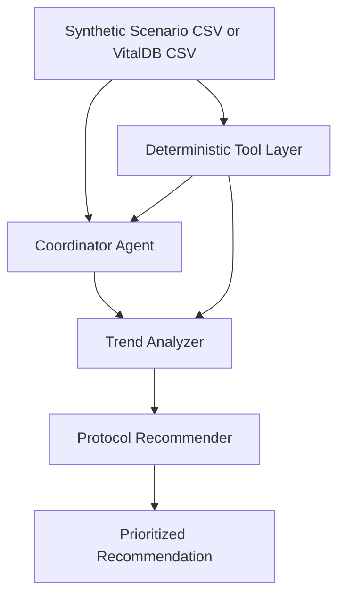

# VitalGuard AI

VitalGuard AI is a Google ADK multi-agent monitoring system for bedside vital signs. It is built for Track B: Quantitative Forge and targets the clinical gap between noisy single-threshold monitor alarms and the gradual multi-parameter deterioration patterns that clinicians often discover too late.

One-line value proposition: VitalGuard watches six monitor signals continuously, computes deterministic early-warning metrics every cycle, and uses an agent pipeline to turn subtle trends into prioritized clinical escalation guidance.


## Why This Matters

Patients rarely crash all at once. They drift. A heart rate trend, a soft blood-pressure decline, and a rising respiratory rate can signal deterioration long before a hard threshold alarm triggers. VitalGuard is designed to catch those interactions earlier while staying quiet for stable patients.

The system monitors this bedside-monitor schema:

- `hr`
- `spo2`
- `sbp`
- `dbp`
- `temp_c`
- `rr`
- `etco2`

## Architecture



## Agent Profiles

### `vitalguard_coordinator`

- loads a built-in scenario or a VitalDB CSV
- advances the session-aware monitor cursor
- packages the current monitoring context for downstream agents
- surfaces recovery states instead of pretending analysis succeeded

### `trend_analyzer`

- calls deterministic analytics for NEWS2, shock index, MAP, slopes, and pattern detection
- detects sepsis triad, compensatory tachycardia, silent deterioration, and desaturation trends
- reports degraded mode when interpolated or imputed signals reduce confidence

### `protocol_recommender`

- maps trend findings into `CRITICAL`, `WARNING`, or `INFO`
- preserves uncertainty and recovery context
- frames results as escalation support, not definitive diagnosis

## Handoff Contract

The coordinator passes a compact state summary into the downstream agents with:

- active dataset name
- dataset source: synthetic scenario or VitalDB
- current minute and completion state
- latest raw vitals
- latest derived metrics
- degraded-mode and recovery details when present

The deterministic tool layer owns validation, normalization, interpolation, clamping, and recovery policy so the LLM agents are interpreting signals rather than inventing operational behavior.

## Tool Layer and Data Sources

### Synthetic scenarios

Located under [`data/scenarios`](/C:/Users/Alson/Desktop/Projects/Gemini Nexus/data/scenarios), the built-in scenarios are:

- `sepsis_onset`
- `compensatory_shock`
- `respiratory_deterioration`
- `stable_postop`

These provide deterministic benchmarks for alert timing and low-noise behavior.

### VitalDB support

The normalizer in [tools/vitaldb_adapter.py](/C:/Users/Alson/Desktop/Projects/Gemini Nexus/tools/vitaldb_adapter.py) maps VitalDB monitor exports into the VitalGuard schema.

Validated VitalDB monitor tracks:

- `Solar8000/HR`
- `Solar8000/PLETH_SPO2`
- `Solar8000/NIBP_SBP`
- `Solar8000/NIBP_DBP`
- `Solar8000/RR`
- `Solar8000/BT`
- `Solar8000/ETCO2`

Accepted fallback aliases are still supported for compatibility, but the tracks above are the primary tested path.

Real case downloader:

```powershell
.\.venv\Scripts\python scripts\download_vitaldb_case.py --caseid 4096 --output data\vitaldb_case_4096.csv
```

## Agentic Recovery

Recovery behavior is explicit and deterministic.

### Missing VitalDB file

- `load_vitaldb_csv(path)` returns a structured recovery response
- the coordinator instructs the user to provide a full Windows path such as `C:\full\path\to\case.csv`

### Missing required tracks

- the VitalDB adapter reports which tracks were found and which required signals are missing
- entirely missing required bedside-monitor tracks block analysis
- optional missing signals such as `temp_c` or `etco2` are imputed and flagged

### Sparse values / NaNs

- sparse gaps in present tracks are linearly interpolated in the tool layer
- degraded mode is attached to the monitoring context so downstream agents mention reduced confidence

### No active scenario loaded

- monitor tools return a recovery response listing the built-in scenarios
- agents do not invent analysis without an active data source

### Minute out of range

- the monitor cursor is clamped deterministically
- the response reports the requested minute, the clamped minute, and the valid range

### Short or empty windows

- the tool layer returns a recovery response instead of crashing
- the agent tells the user to advance the stream or jump to a later minute

## Technical Depth

Deterministic analytics live in [tools/analytics.py](/C:/Users/Alson/Desktop/Projects/Gemini Nexus/tools/analytics.py):

- NEWS2 scoring
- shock index
- MAP
- baseline deviation
- 3-point and 5-point rolling means
- per-minute slope estimation
- qSOFA-limited check using RR and SBP
- multi-parameter pattern detection

This separation is intentional: the LLM agents interpret deterministic outputs rather than generating safety-critical metrics from scratch.

## System Robustness

The project is designed to be robust under judge-facing conditions:

- session-aware monitor tools keep dataset cursor state inside ADK sessions
- deterministic scenario verification is available via [`scripts/verify_scenarios.py`](/C:/Users/Alson/Desktop/Projects/Gemini Nexus/scripts/verify_scenarios.py)
- reproducible evaluation is available via [`scripts/evaluate_vitalguard.py`](/C:/Users/Alson/Desktop/Projects/Gemini Nexus/scripts/evaluate_vitalguard.py)
- a stable-patient benchmark proves the system stays `INFO`
- a degraded VitalDB benchmark proves the system can continue through missing temperature and intermittent NIBP

Latest evaluation outputs are written to:

- [`data/eval_reports/vitalguard_evaluation.json`](/C:/Users/Alson/Desktop/Projects/Gemini Nexus/data/eval_reports/vitalguard_evaluation.json)
- [`data/eval_reports/vitalguard_evaluation.md`](/C:/Users/Alson/Desktop/Projects/Gemini Nexus/data/eval_reports/vitalguard_evaluation.md)

## Documentation / Demo

### Local setup

1. Create and activate the virtual environment:

```powershell
python -m venv .venv
.\.venv\Scripts\activate
```

2. Install dependencies:

```powershell
pip install -r requirements.txt
```

3. Configure Google AI Studio access:

```powershell
copy .env.example .env
notepad .env
```

Put this in `.env`:

```env
GOOGLE_API_KEY=your-google-ai-studio-api-key
VITALGUARD_MODEL=gemini-2.5-flash
```

4. Generate the synthetic scenarios:

```powershell
python tools\generate_scenarios.py
```

5. Run deterministic checks:

```powershell
python scripts\verify_scenarios.py
python scripts\evaluate_vitalguard.py
```

6. Start the ADK Web UI:

```powershell
python -m google.adk.cli web agents
```

### Demo flow

Recommended live prompts:

```text
Load scenario sepsis_onset and assess the patient
```

```text
Load scenario compensatory_shock and assess the patient
```

```text
Load scenario respiratory_deterioration and assess the patient
```

```text
Load scenario stable_postop and assess the patient
```

```text
Load VitalDB file C:\Users\Alson\Desktop\Projects\Gemini Nexus\data\vitaldb_case_4096.csv and assess minute 25
```

Expected demo outcomes:

- sepsis scenario escalates early with sepsis-triad / rising-risk language
- bleeding scenario warns before frank hypotension
- respiratory scenario warns on the trend before severe desaturation
- stable scenario stays quiet
- VitalDB scenario proves the same toolchain works on a real public case

### Backup demo artifacts

Recommended artifact locations are documented in [app/demo-artifacts.md](/C:/Users/Alson/Desktop/Projects/Gemini Nexus/app/demo-artifacts.md).

## Evaluation Scenarios

The evaluation script reports:

- first alert minute
- resulting severity
- triggered patterns
- pass/fail against expected scenario behavior

It covers:

- `sepsis_onset`
- `compensatory_shock`
- `respiratory_deterioration`
- `stable_postop`
- one real VitalDB case
- one degraded VitalDB case with missing temperature and intermittent NIBP

## Repo Layout

- [`agents`](/C:/Users/Alson/Desktop/Projects/Gemini Nexus/agents)
- [`tools`](/C:/Users/Alson/Desktop/Projects/Gemini Nexus/tools)
- [`scripts`](/C:/Users/Alson/Desktop/Projects/Gemini Nexus/scripts)
- [`app`](/C:/Users/Alson/Desktop/Projects/Gemini Nexus/app)

## Limitations

- This prototype is for hackathon demonstration only and does not provide medical diagnosis.
- qSOFA is intentionally limited because mental status is not present in the monitor feed.
- Missing required VitalDB bedside-monitor tracks block analysis rather than being guessed.
- The current UI is the ADK Web UI; a custom dashboard remains optional stretch work.
